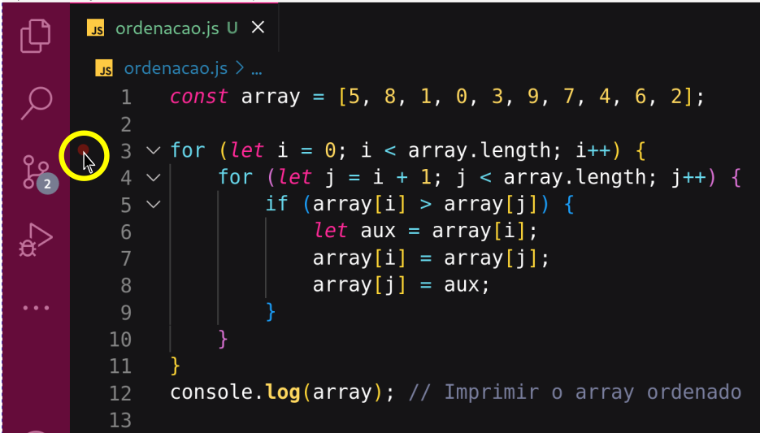
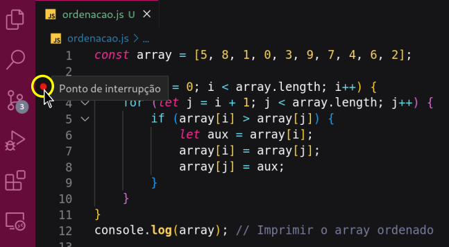
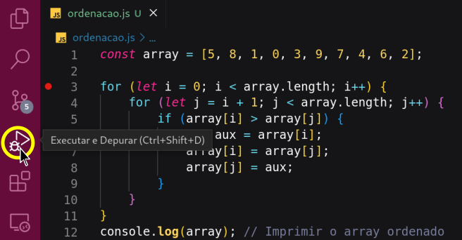
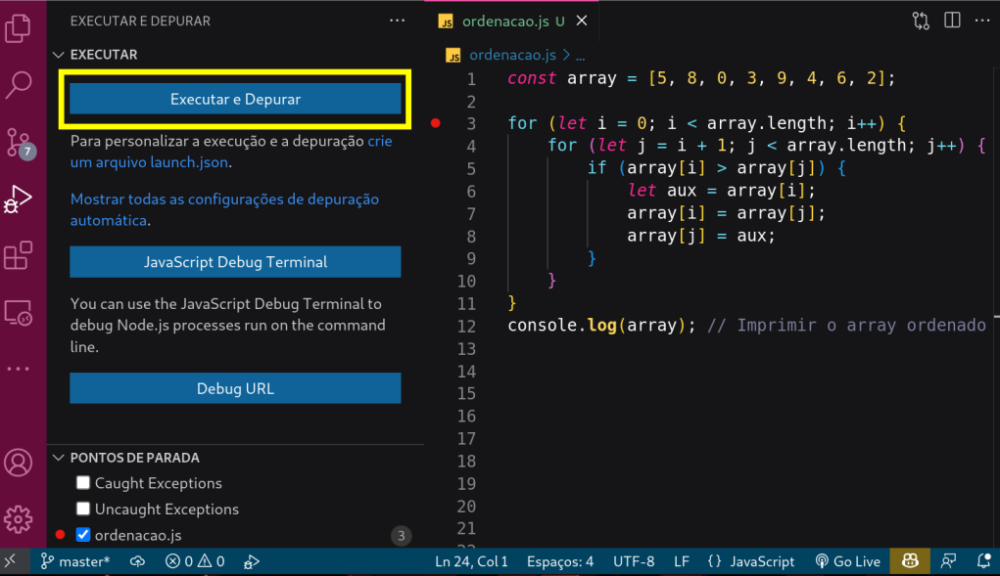
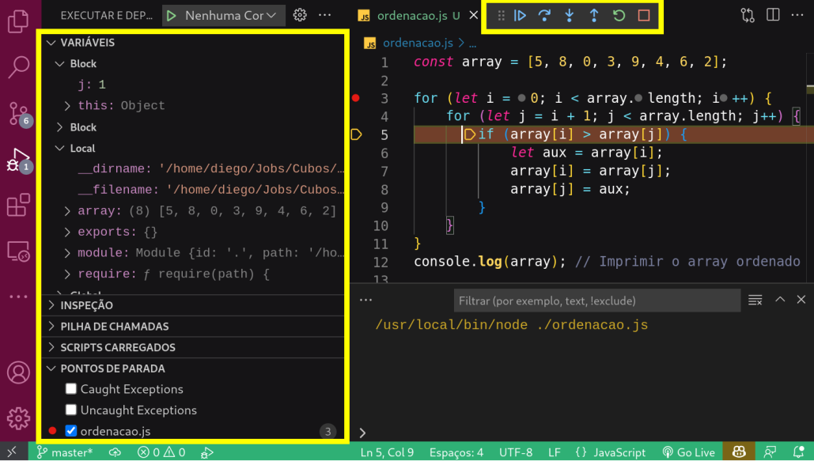

## Como debugar seu código

  
1. Você sabe o que é Debugar?

  - Debugar é o processo de localizar erros ou verificar se o código está funcionando corretamente.

  - Mas também pode ser usado para entender a lógica implementada por outro desenvolvedor.

  
2. Curiosidade: O que é um bug?

  - `Bug` é um erro que ocorre durante o desenvolvimento de um software. 
  - `Debugar` é desfazer este erro.

  
3. Debugando o código no VsCode

  - Passo 1: Ao passar o mouse antes da numeração da linha, perceba que vai ficar vermelho, essa indicação serve para informar o ponto de interrupção que desejo começar a debugar.
  
  

  - Passo 2: Ao clicar no ponto vermleho, a linha ficará marcada, indicando que a execução será interrompida e você poderá ver o que está acontecendo quando estiver debugando.

  

  - Passo 3: No menu vertical do VsCode, escolhe a opção `Executar e Depurar`

  

  - Passo 4: Irá abrir uma janela com três opções, você irá clicar na primeira opção `Executar e Depurar`. 

  

  - Passo 5: 
    - Você poderá utilizar os botões de controle para sair debugando o seu código
    - A janela do lado esquedo, serve para acompanhar as modificações acontencendo no momento da execução.

  

  

